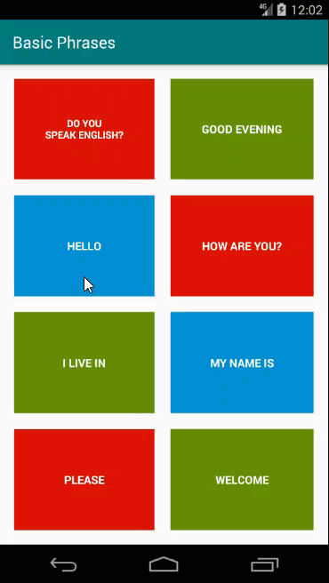

# Android App: Using Java

## Repository for my Basic Phrases, English to Spanish translator Android app

Find out how to build a simple Basic Phrases app. Author Melvin Kisten tackles Tags, working with Images and a MediaPlayer. 

## Instructions
1. Make sure you have these installed
	- [Android Studio](https://developer.android.com/studio#downloads "Android Studio")
2. Clone this repository into your local machine using the terminal (mac) or [Gitbash (PC)](https://git-scm.com/download/win "Gitbash (PC)")
	
	`> git clone https://github.com/iammelvink/basic-phrases.git`
3. Run Android Studio and choose Open an existing Android Sudio project
4. Press play button to run the app 

## Installation
1. Download the app from the Google Play Store by following this link: [Basic Phrases](https://play.google.com/store/apps/details?id=com.iammelvink.basicphrases "Basic Phrases by Melvin Kisten")

## More Stuff
Check out some of my other stuff on [WiiLearnTech](https://www.wiilearntech.com "WiiLearnTech Website"). Follow me on [Twitter](https://twitter.com/iammelvink "iammelvink") and [Instagram](https://www.instagram.com/iammelvink "iammelvink"), or check out my [YouTube channel](https://www.youtube.com/channel/UCwMGEkyU2QOqEEKJ1E5pe7w "WiiLearnTech YouTube").